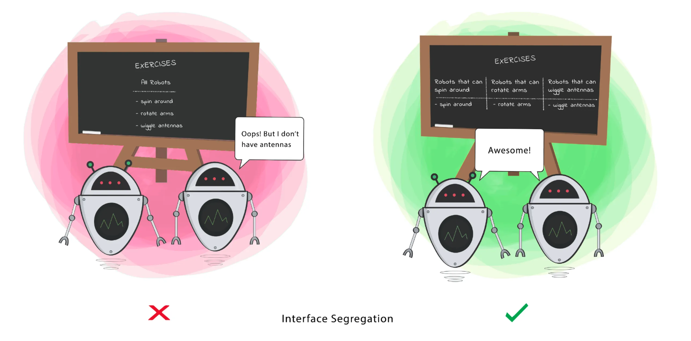

# SOLID Principles

## S - Single Responsibility Principle (SRP)

This means that a class should have only a single responsibility. 

For example, if you're designing a restaurant, there should be separate classes for a Chef, a Waiter, and a Cashier. One class should not be dealing with all of these responsibilities.

## O - Open Closed Principle (OCP)

This means that a class should be OPEN for extention but CLOSED for modification.

In the same restaurant example, the cashier can be extended to showing guests to tables but you can't change the cashier's main responsibility.

## L - Liskov's Substitution

If S is a subtype of T, then objects of type T can be replaced with objects of type S wihtout altering any of the desired functionalities. 

If you have a Class and create another Class from it, it becomes a parent and the new Class becomes a child. The child Class should be able to do everything the parent Class can do. This process is called **inheritance**.

The child Class should be able to process the same requests and deliver the same result as the parent Class or it could deliver a result that is of the same type.

For example, if the Chef can make coffee, it means that it they can make any type of coffee. When a child class of Chef is created, the child should be able to make some sort of coffee, if not all types of coffee.

## I - Interface Segregation

A Class should perform only actions that are needed to fulfil its role. Any other action should be removed completely or moved somewhere else if it might be used by another Class in the future.

## D - Dependacy Inversion

This principle says a Class should not be fused with the tool it uses to execute an action. Rather, it should be fused to the interface that will allow the tool to connect to the Class.

It also says that both the Class and the interface should not know how the tool works. However, the tool needs to meet the specification of the interface.

This principle aims at reducing the dependency of a high-level Class on the low-level Class by introducing an interface.